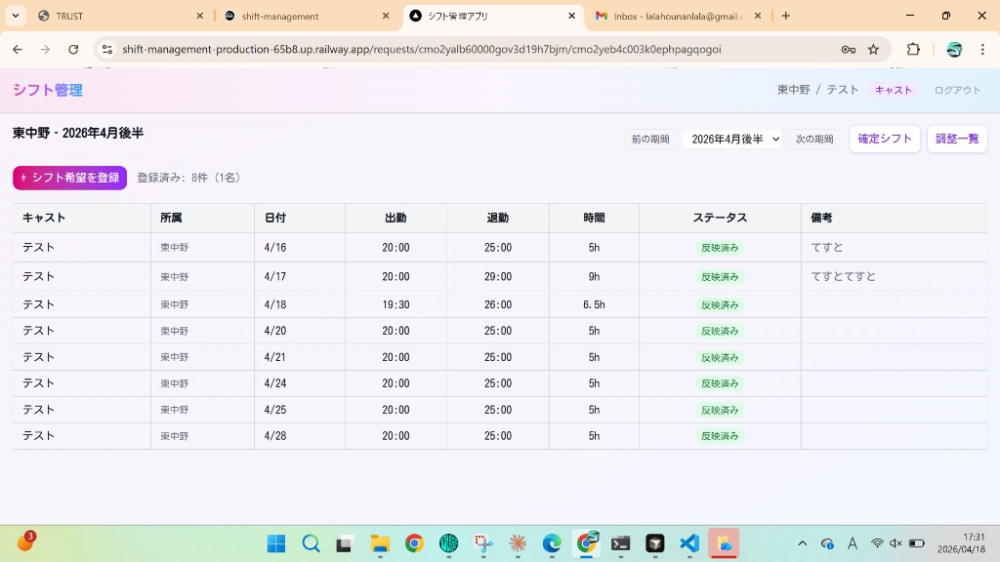
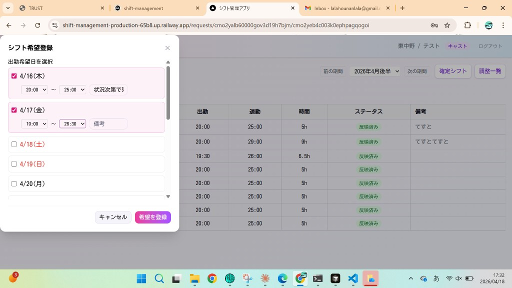
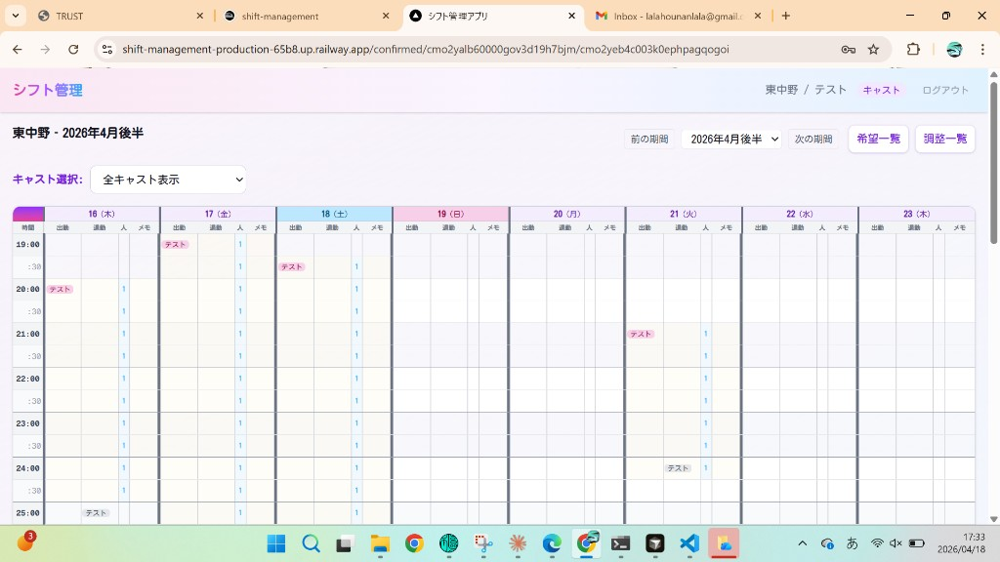
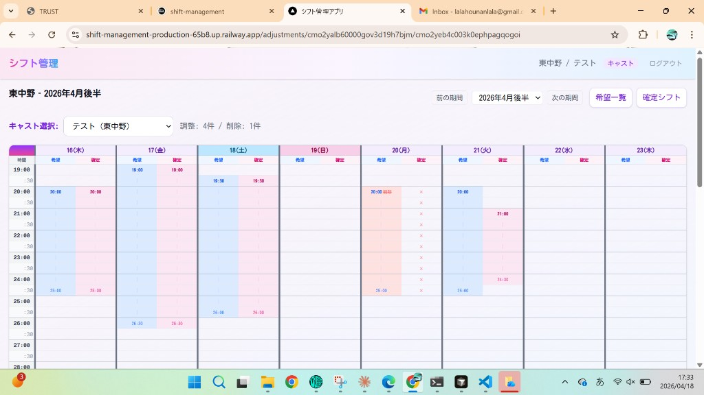
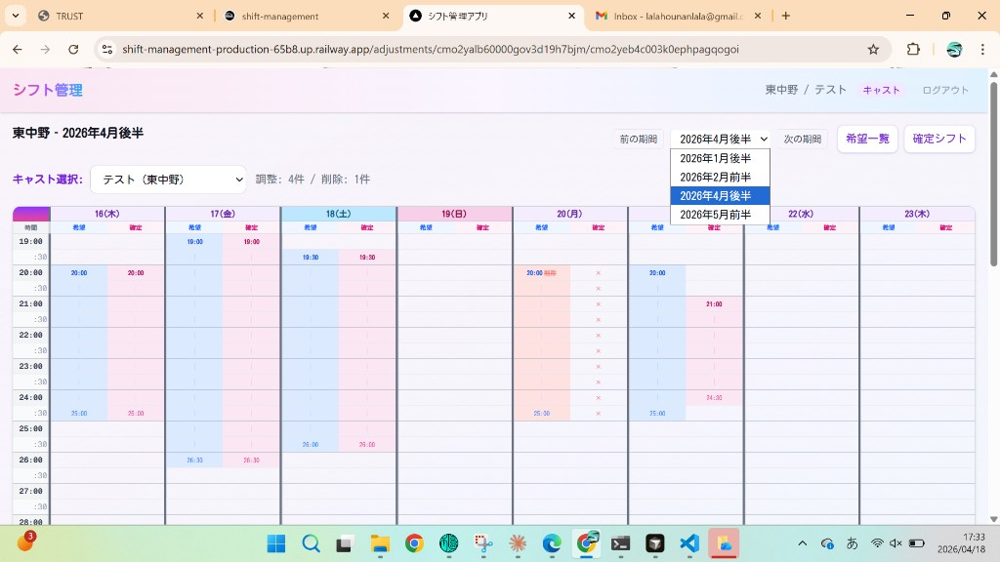
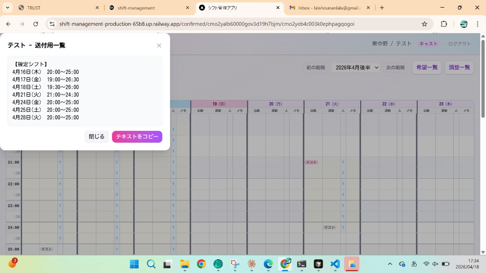

# キャスト向け シフト管理アプリ マニュアル

キャスト権限でログインしたときに使う画面の説明です。**店長・管理者向けの全体のマニュアル**は `docs/USER_MANUAL.md` にあります。

**PDF版:** 同じ内容の PDF は `docs/CAST_MANUAL.pdf` に置けます。再生成はプロジェクト直下で `npm run docs:pdf:cast`（Google Chrome が必要です）。

> **スクリーンショット**  
> 本章の画像は `docs/manual-images/cast-*.png` です。差し替えは**同じファイル名で上書き**してください。

---

## 目次

1. [ログインと画面上部](#1-ログインと画面上部)
2. [希望一覧（自分の希望の確認）](#2-希望一覧自分の希望の確認)
3. [シフト希望の登録（モーダル）](#3-シフト希望の登録モーダル)
4. [確定シフト](#4-確定シフト)
5. [調整一覧（希望と確定の比較）](#5-調整一覧希望と確定の比較)
6. [期間の切り替え](#6-期間の切り替え)
7. [送付用一覧（テキストをコピー）](#7-送付用一覧テキストをコピー)
8. [時間の見方（深夜・翌朝）](#8-時間の見方深夜翌朝)
9. [困ったとき](#9-困ったとき)

---

## 1. ログインと画面上部

1. ブラウザでアプリの URL を開きます。  
2. 運用で案内されている **キャストID** と **パスワード** でログインします。

ログイン後、画面上部に次のような情報が出ます。

- **左:** アプリ名「シフト管理」  
- **右:** 「店舗名 / あなたの表示名」、権限 **キャスト**、**ログインアウト**

期間の見出し（例: 東中野 ‐ 2026年4月後半）の近くに **前の期間**・**次の期間**・**期間のプルダウン** があります。細かい操作は [6. 期間の切り替え](#6-期間の切り替え) を参照してください。

（ログイン画面のキャプチャを載せる場合は、運用で `manual-images/cast-00-login.png` を置き、本章に画像を追加してください。）

---

## 2. 希望一覧（自分の希望の確認）

**希望一覧**では、いま出している希望が表で一覧になります。

- **＋ シフト希望を登録** … 新しい希望や追加分を登録します（次章）。
- **登録済み: ○件** … 件数の目安が表示されます。
- **確定シフト**・**調整一覧** … それぞれの画面に切り替わります（後述）。
- 表には **日付・出勤・退勤・時間・ステータス（未反映・反映済み など）・備考** があります。

---

## 3. シフト希望の登録（モーダル）

**＋ シフト希望を登録** を押すと、**シフト希望登録**のウィンドウが開きます。

1. **出勤希望日を選択** … 日付にチェックを入れます。  
2. 選んだ日ごとに **出勤〜退勤** の時間を指定します。  
3. 必要なら **備考** にメモを書きます。  
4. **希望を登録** で確定します。**キャンセル** は取り消しです。

締切後は登録・変更できないことがあります（店舗の運用に従ってください）。

---

## 4. 確定シフト

**確定シフト**では、決まったシフトを**表（カレンダー状の格子）**で見られます。

- **キャスト選択** … 「全キャスト表示」や、自分だけに絞るなど運用に合わせて選びます。
- 時間が縦、日付が横のマスに、あなたの名前などが表示されます。

上部の **希望一覧**・**調整一覧** から、いつでも別画面へ移れます。

---

## 5. 調整一覧（希望と確定の比較）

**調整一覧**では、**希望** と **確定** が並んだ表で、店舗側の調整内容を確認できます。

- **キャスト選択** … 自分を選ぶと、自分の希望と確定だけを見比べやすくなります。
- **調整: ○件 / 削除: ○件** のように、変更や削除の概要が示されることがあります。
- 各日について、左が希望・右が確定です。**短くなった・消えた** などは、その差分として表示されます。

---

## 6. 期間の切り替え

見たい **月の前半／後半** を変えるには、**前の期間** / **次の期間** か、**期間のプルダウン** を使います。一覧から選ぶと、その期間の希望・確定・調整の内容に切り替わります。

---

## 7. 送付用一覧（テキストをコピー）

**確定シフト**などから開ける **送付用一覧** では、確定したシフトが**テキスト**でまとまっています。チャットなどに貼り付けて共有しやすくするための画面です。

- **テキストをコピー** … クリップボードにコピーします。  
- **閉じる** … ウィンドウを閉じます。

---

## 8. 時間の見方（深夜・翌朝）

退勤が **24:00 を超える表記**（例: 25:00、26:30、29:00）のときは、**翌日の深夜・早朝**を表しています。アプリの一覧でも同じ考え方で表示されます。

---

## 9. 困ったとき

| 症状 | 試してほしいこと |
|------|------------------|
| ログインできない | キャストID・パスワードの打ち間違い、大文字小文字を確認 |
| 希望を登録できない | **締切**になっていないか、管理者に確認 |
| 画面が古い | ブラウザの再読み込み（更新） |

---

## 改訂履歴

| 日付 | 内容 |
|------|------|
| 2026-04-18 | キャスト専用マニュアルとして新設。実画面キャプチャ（`cast-01`〜`cast-06`）を配置 |
