# シフト管理アプリ 利用マニュアル

店舗のシフト作成・希望の受付・調整の確認・確定シフトの閲覧までを、ブラウザ上で行うための手引きです。**はじめて使う方**向けに、画面の見どころと操作の流れを説明します。

**PDF版:** 同じ内容の PDF は `docs/USER_MANUAL.pdf` にあります（この Markdown を更新したあと再生成する場合は、プロジェクト直下で `npm run docs:pdf`。Google Chrome が必要です）。

> **📷 スクリーンショット**  
> 本章末付近の画像は `docs/manual-images/` に保存した実画面のキャプチャです（GitHub の Markdown プレビューや VS Code で表示されます）。差し替える場合は同じファイル名で上書きしてください。

---

## 目次

1. [このアプリでできること](#1-このアプリでできること)
2. [ユーザーの種類（権限）](#2-ユーザーの種類権限)
3. [ログイン](#3-ログイン)
4. [ダッシュボード（店舗と期間の入口）](#4-ダッシュボード店舗と期間の入口)
5. [シフト表（管理者・社員）](#5-シフト表管理者社員)
6. [日別情報（営業日のメモ）](#6-日別情報営業日のメモ)
7. [希望一覧（シフト希望の登録・確認）](#7-希望一覧シフト希望の登録確認)
8. [調整一覧](#8-調整一覧)
9. [確定シフト](#9-確定シフト)
10. [キャストの方へ](#10-キャストの方へ)
11. [管理者向け：キャスト・店舗](#11-管理者向けキャスト店舗)
12. [締切について](#12-締切について)
13. [困ったとき](#13-困ったとき)

---

## 1. このアプリでできること

- **シフト表** … 日ごと・時間ごとに誰が出勤するかを編集するメイン画面です。
- **希望一覧** … キャストが出したい時間（希望）を登録・一覧で確認します。
- **調整一覧** … 希望と実際のシフトの差分を、表形式で確認します。
- **確定シフト** … 決まったシフトを確認します（キャストは自分の分だけ表示されることがあります）。
- **ダッシュボード** … 店舗ごとに、上記画面へのリンク付きで期間が並びます。

---

## 2. ユーザーの種類（権限）

| 種類 | 主な利用画面 |
|------|----------------|
| **管理者** | すべての店舗・シフト表・希望・調整・確定、キャスト／店舗の管理 |
| **社員** | 所属に応じた店舗のシフト表・希望・調整・確定（管理者に近い操作） |
| **キャスト** | 主に**希望一覧**で自分の希望を登録。確定・調整の閲覧など |

ログイン後、画面上部のメニューに出る項目が権限によって少し違います。

---

## 3. ログイン

1. ブラウザでアプリの URL を開きます。
2. **キャストID**（または運用で案内されているログイン名）と**パスワード**を入力します。
3. **ログイン**ボタンを押します。

> **画面のイメージ（ログイン）**  
> 中央付近に白いカードがあり、「キャストID」「パスワード」の入力欄とログインボタンがあります。エラー時はその下に赤い説明文が出ます。

（ログイン画面のキャプチャを載げる場合は `manual-images/01-login.png` を追加してください。）

---

## 4. ダッシュボード（店舗と期間の入口）

管理者・社員がログインすると、まず**ダッシュボード**に入ることが多いです。

### 画面の構成

- **上段の見出し** … いま選んでいる期間の月（例：4月後半〜5月前半）と「シフト管理」というタイトルが並びます。
- **「期間」** … ドロップダウンで**何月の前半／後半**から表示を始めるか選べます。
- **「表示」ボタン** … 期間を変えたあと、押すと一覧が更新されます。
- **店舗のカード** … 店名の下に、その期間の**希望・調整・シフト表**へのリンクがあります。

> **画面のイメージ（ダッシュボード）**  
> グリッド状に店舗名のカードが並び、各行に「4月後半」「5月前半」のように期間ラベルと、右側に「希望」「調整」「シフト表」のリンクがあります。いま操作中の期間には「現在」という小さなバッジが付くことがあります。

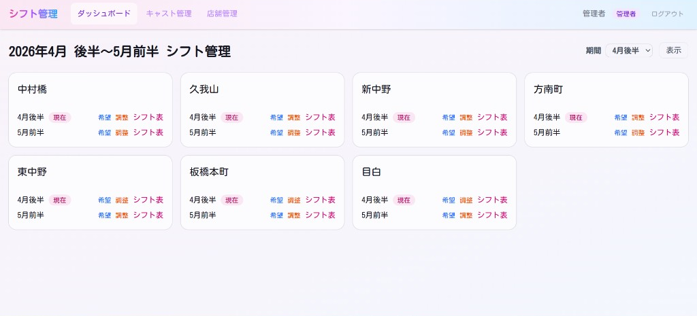

### 操作の流れ（例）

1. 見たい**月の前半／後半**を「期間」で選ぶ。  
2. **表示**を押す。  
3. 店舗カードの **シフト表**（または希望・調整）を押して、その画面へ進む。

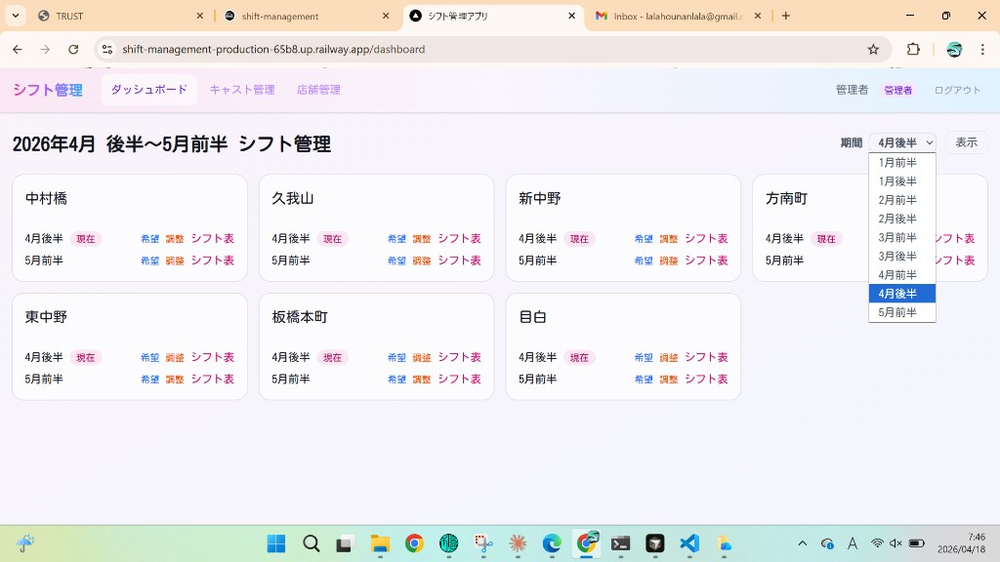

---

## 5. シフト表（管理者・社員）

シフト表は、**時間**が縦、**日付**が横の表です。

### 画面上部

- **← ダッシュボード** … 一覧に戻ります。
- **店名‐年月・前半／後半** … いま開いている期間です。
- **希望を締め切る**（管理者のみ） … 希望の受付とシフト表の追加・変更をまとめて止めます（詳しくは [12. 締切について](#12-締切について)）。
- **確定シフト・希望一覧・調整一覧** … 枠付きのボタン風リンクで、それぞれの画面に移ります。

> **画面のイメージ（シフト表）**  
> ピンク〜紫のヘッダー列に日付（16(木) など）が並び、各日の上に青い「＋営業情報」、ピンクの「＋追加シフト」があります。表の中にキャスト名や人数が入ります。

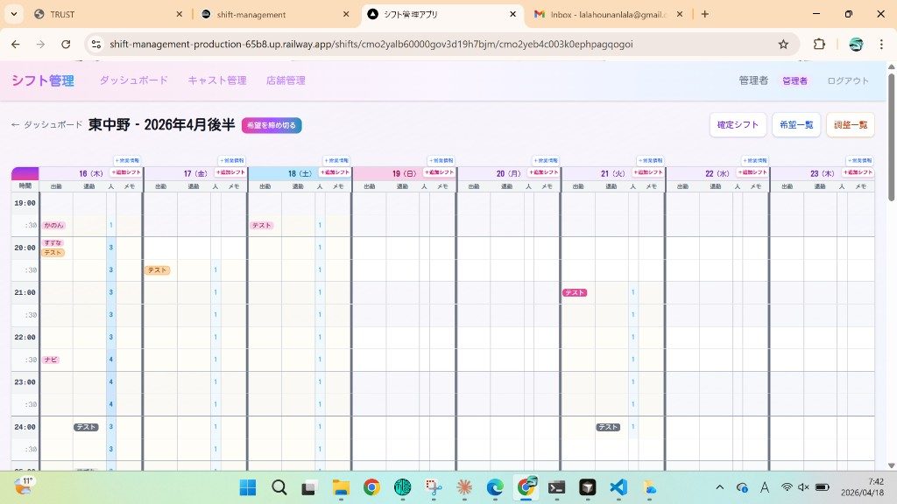

### よく使う操作

| 操作 | やり方 |
|------|--------|
| 日ごとのメモ（予算・企画名など） | その日の上にある **＋営業情報** を押す（下記「日別情報」参照） |
| キャストを1人追加 | **＋追加シフト** から日付を選んで追加 |
| セルの編集 | 該当するマスを押して表示される画面で変更 |

※ シフトの**追加・変更が止まっている期間**は、締切設定により編集できません。

### シフト表からキャストを追加する（＋追加シフト）

日付列の **＋追加シフト** を押すと、出勤・退勤時間を選んでキャストを追加する画面が開きます。

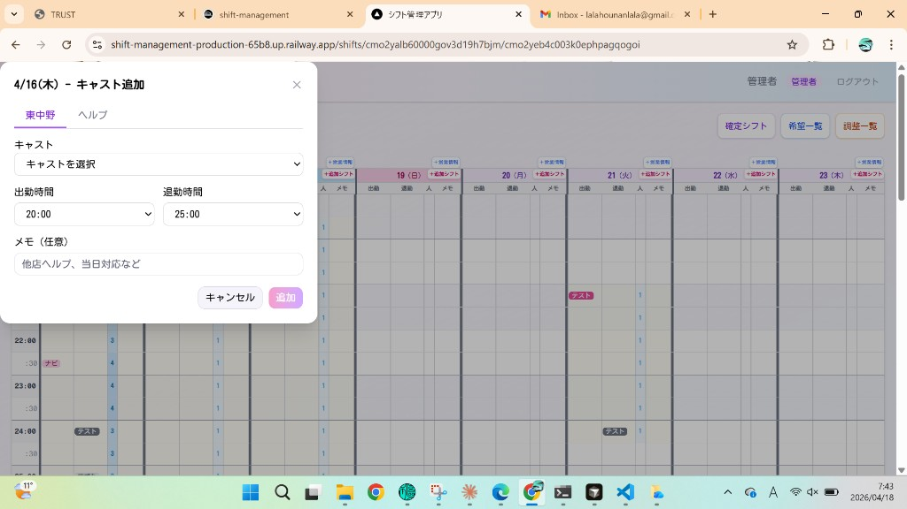

---

## 6. 日別情報（営業日のメモ）

**＋営業情報** を押すと、その日専用の入力画面（モーダル）が開きます。

入力できる例：

- **目標予算（円）**
- **出勤社員**
- **企画名**
- **ご来店予定**
- **備考**

入力後は **保存** を押すと反映されます。**キャンセル** で閉じるだけなら保存されません。

> **画面のイメージ（日別情報）**  
> 「4/16(木) - 日別情報」のようなタイトルで、複数行の入力欄と「キャンセル」「保存」ボタンがあります。

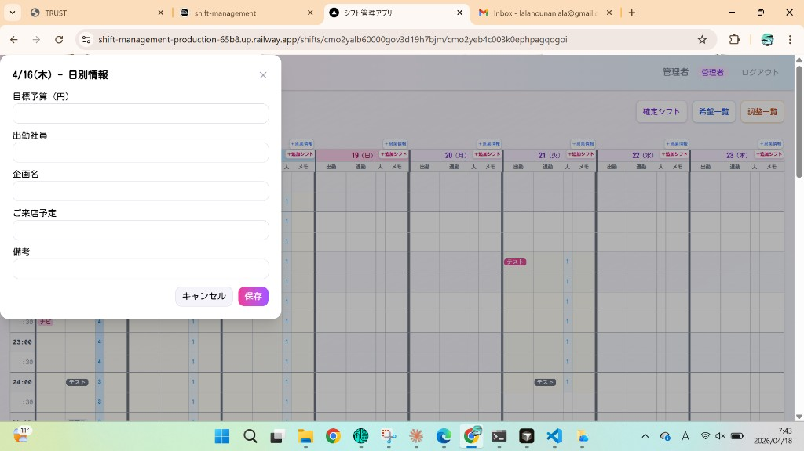

---

## 7. 希望一覧（シフト希望の登録・確認）

### 管理者・社員

- 店舗のキャスト全員分（および運用に応じた他店舗分）の希望が一覧になります。
- **＋シフト希望を登録** で、キャストを選んで複数日出勤希望をまとめて登録できます。
- 各行の **削除** で希望を消せます（締切後は不可）。
- ステータス列に **未反映・反映済み・調整済** などが表示されます。

> **画面のイメージ（希望一覧）**  
> 上にピンクの登録ボタン、その下にキャスト名・日付・時間・ステータス・備考の表があります。スマホでは横にスクロールして全体を見られます。

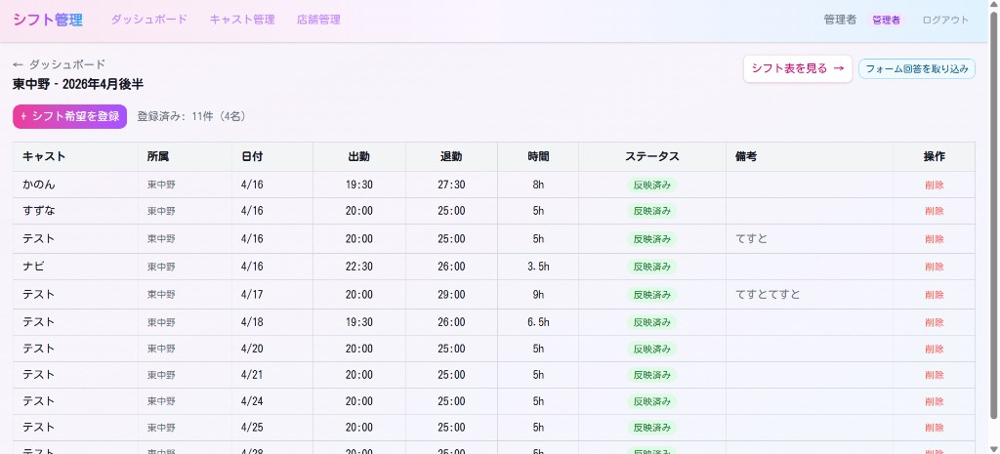

### キャスト

ログイン後、多くの場合**そのまま希望一覧**に進みます（マイページから自動で移る動きがあります）。  
自分の希望だけを登録・確認します。

---

## 8. 調整一覧

- **キャスト選択** で見る人を選びます（一覧に出ているキャストから選択）。
- 各日について **希望** と **確定** の帯が並び、調整の内容が分かりやすく表示されます。
- 上部から **希望一覧**・**確定シフト** へ移れます。

> **画面のイメージ（調整一覧）**  
> 「キャスト選択：」とプルダウン、その右に調整件数の集計。下に時間軸付きの大きな表があります。

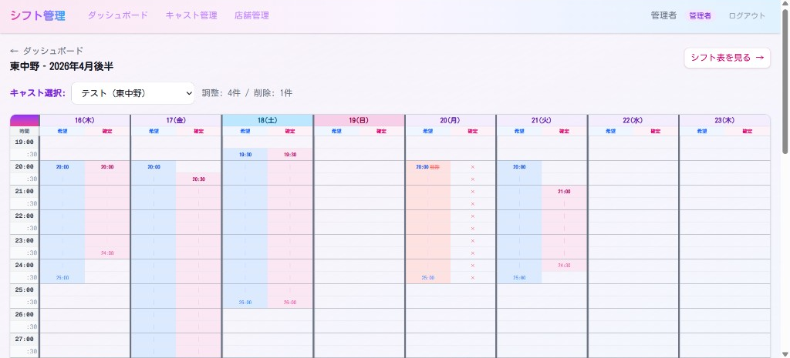

---

## 9. 確定シフト

- **全キャスト表示** か、キャストを一人選んで、その人のシフトだけを見ることができます。
- 必要に応じて **送付用一覧** などの機能があります（表示される場合のみご利用ください）。
- **希望一覧・調整一覧** へ移るリンクがあります。

> **画面のイメージ（確定シフト）**  
> シフト表に近い格子状の表で、出勤・退勤・人数・メモの列があります。

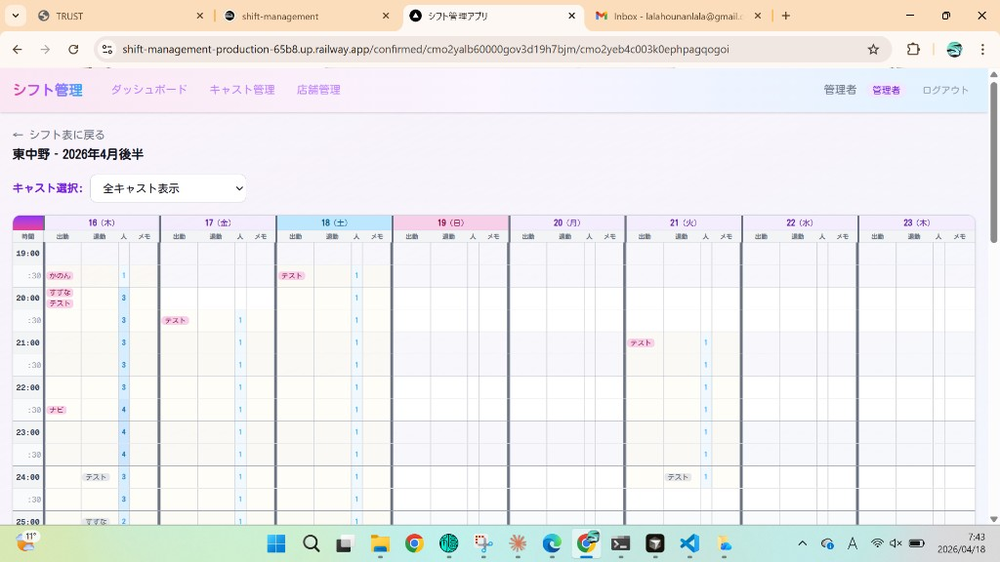

---

## 10. キャストの方へ

**キャスト権限での操作・画面の見方だけをまとめた別ページ**があります。

- **「キャスト向け マニュアル（Markdown）」:** `docs/CAST_MANUAL.md`  
- **PDF を用意する場合:** プロジェクト直下で `npm run docs:pdf:cast` → `docs/CAST_MANUAL.pdf`

※ ここでは共通の用語だけ示します。**希望の登録・変更**は **希望一覧**、決まったシフトの確認は **確定シフト**、希望との差分は **調整一覧** を使います。詳細と実画面のキャプチャは上記 `CAST_MANUAL` を参照してください。

---

## 11. 管理者向け：キャスト・店舗

- **キャスト管理（在籍キャスト一覧）** … メニューから入り、キャストの追加・編集・削除・所属店舗の設定ができます。
- **店舗管理** … 店舗名の管理など（管理者のみ表示される画面です）。

キャストの削除は関連データに影響するため、運用ルールに従って慎重に行ってください。

### 在籍キャスト一覧

店舗タブで店舗を選び、一覧の **編集**・**PW再発行**・**削除** を使います。

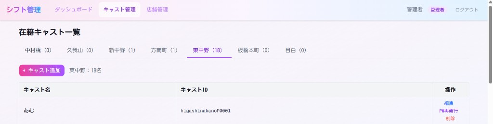

### キャストの追加

**＋キャスト追加** を押すと、名前・所属店舗・キャストID・パスワードを入力する画面が開きます。

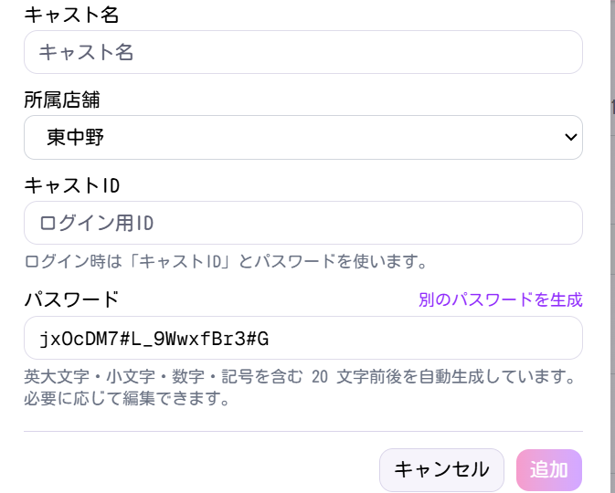

### キャストの編集

一覧の **編集** から、名前・所属・キャストIDを変更できます（キャストIDを変えるとログインIDも変わります）。

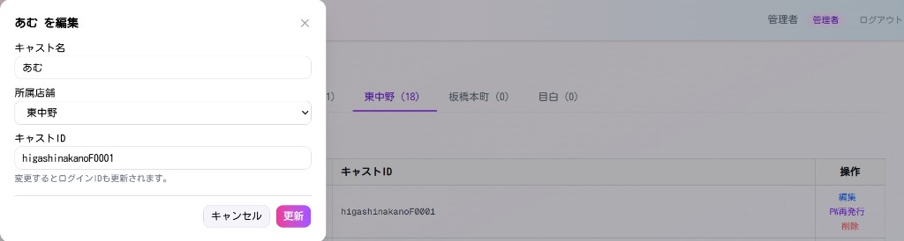

### パスワードの再発行

**PW再発行** を押すと確認ダイアログが出ます。**OK** で再発行処理に進みます。

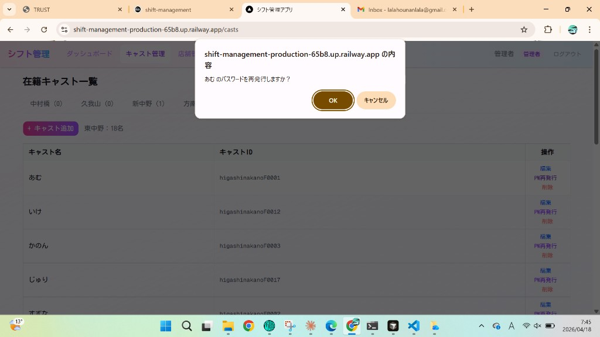

### キャストの削除

**削除** を押すと確認ダイアログが出ます。誤操作に注意してください。

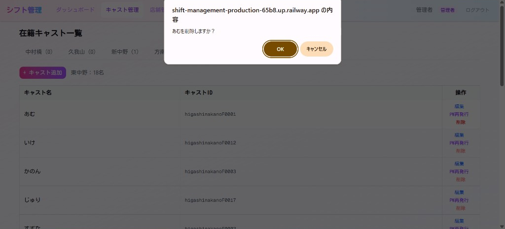

### 店舗管理

店舗名とキャスト人数の一覧から **＋店舗追加** や **編集** で店舗を管理します。

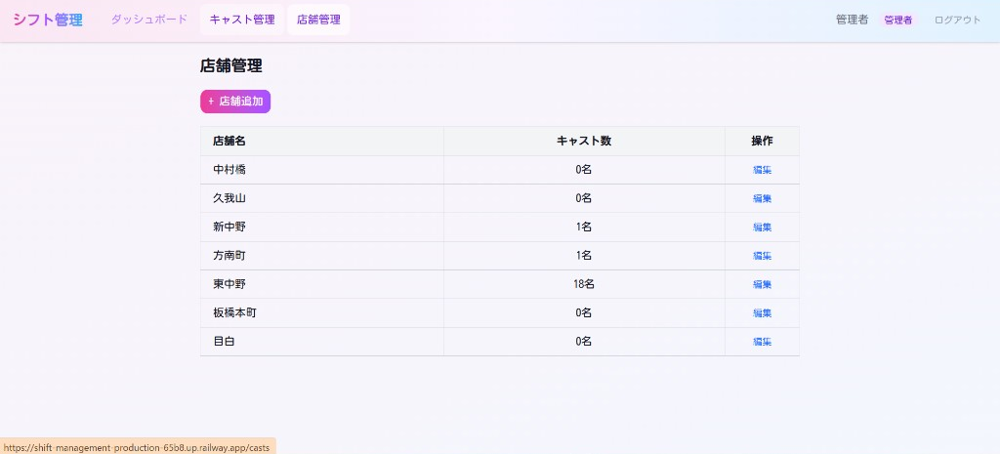

---

## 12. 締切について

シフト表画面（管理者・社員）に **希望を締め切る** ボタンがある場合：

- 押すと **シフト希望の受付** と **シフト表への追加・変更** がまとめて止まります。
- もう一度押すと **締切を解除** できます（文言は画面に合わせてください）。

締切中は、希望の新規登録やシフト表の編集、フォーム取り込みなどができなくなる仕組みです。

---

## 13. 困ったとき

| 症状 | 試してほしいこと |
|------|------------------|
| ログインできない | キャストID・パスワードの打ち間違い、大文字小文字を確認 |
| 画面が古い | ブラウザの再読み込み（更新） |
| ボタンが押せない | 締切中でないか、権限（キャスト／社員／管理者）を確認 |
| シート書出・取込が見えない | 運用設定により**一時的に非表示**になっていることがあります。管理者に確認してください |

---

## 改訂履歴

| 日付 | 内容 |
|------|------|
| 2026-04-17 | 初版作成（テキスト中心。画像は `manual-images/README.md` 参照） |
| 2026-04-18 | 実画面キャプチャを `manual-images/` に配置し、本文へ埋め込み |
| 2026-04-18 | キャスト専用の手引きを `CAST_MANUAL.md` に分離（`USER_MANUAL` §10 は参照のみ） |
